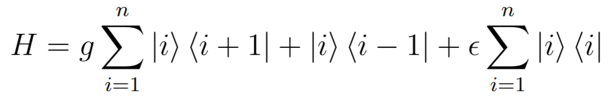
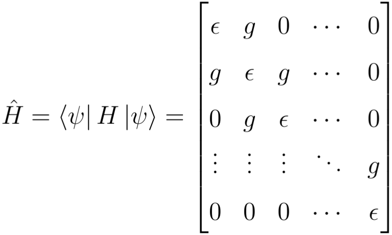

# Hamiltonian-Matrix
Generating a hamiltonian in the matrix form
## Hamiltonian
The Hamiltonian can be represented by creation and annihilation operators terms, using the dirac bracket notation the Hamiltonian of system can be write as follows:

In this program we are only concerned with computing the matrix of our Hamiltonian operator, i.e. our matrix has the following form:

